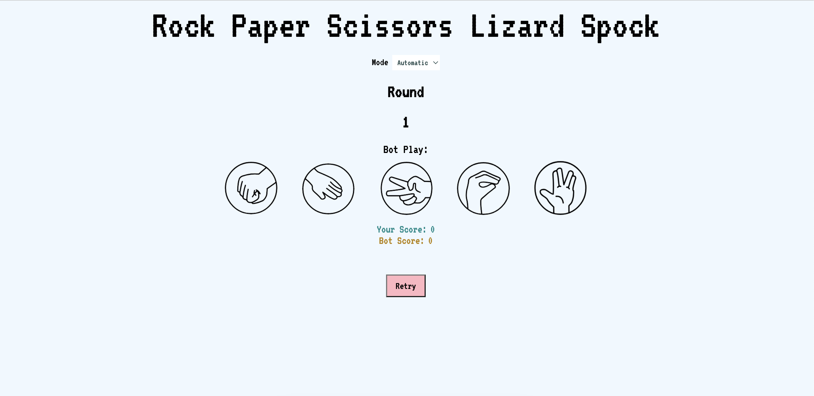
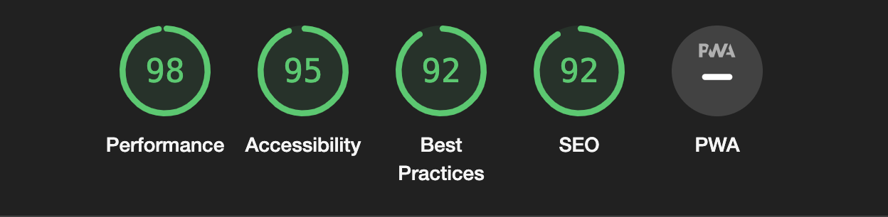
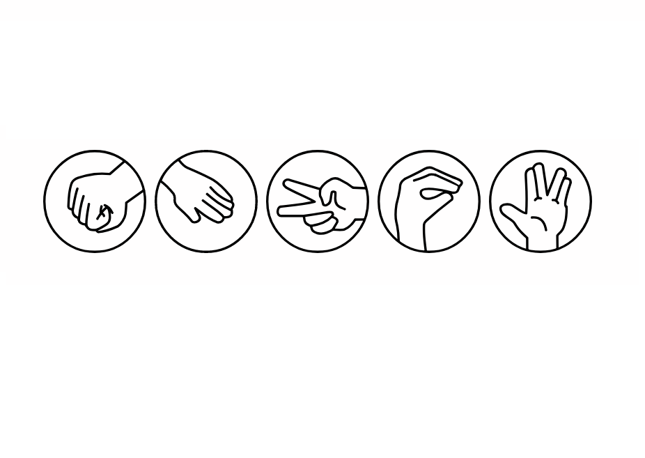

# Rock Paper Scissors Lizard Spock Game
[Visit the Website](https://missdays.github.io/Lizard-Spock-and-Beyond/)

This is a web-based implementation of the Rock Paper Scissors Lizard Spock game using HTML, CSS, and JavaScript.

## Game Rules

The game follows the rules popularized by the TV show "The Big Bang Theory":
- Scissors cuts Paper,
- Paper covers Rock,
- Rock crushes Lizard,
- Lizard poisons Spock,
- Spock smashes Scissors,
- Scissors decapitate Lizard,
- Lizard eats Paper,
- Paper disproves Spock,
- Spock vaporizes Rock,
- Rock crushes Scissors,

## How to Play

1. Open the game link in your web browser.
2. Set the game mode to Easy, Medium or Hard or leave it on Automatic.
3. Click on one of the buttons: Rock, Paper, Scissors, Lizard, or Spock.
4. The computer will randomly choose its move.
5. There is a limit of 6 rounds.
6. The result of the game will be displayed on the screen, indicating whether you win, lose, or it's a draw.
7. Once you select the difficulty mode, you will not be able to change it until the game finishes or you press "retry".
8. Play again by clicking retry or refresh the page.

## Features Left to Implement 
1. Add hand gesture images to represent bot play.
2. Add sound effects

## Testing 
- I tested that this page works in different browsers: Chrome, Safari.
- I confirm that this website is functional and responsive.

## Validator Testing
- Accessibility: I confirm that the colours and fonts chosen are accessible for running it through lighthouse in devtools.
- HTML: No errors were returned when passing through the official W3C validator.
- CSS: No errors were returned when passing through the official (Jigsaw) validator.

## Bugs
- No bugs

## Deployment 
The website was deployed to GitHub pages. The steps to deploy are as follows:
- In the GitHub repo, navigate to the Settings tab, select Pages,
- From the source section drop-down menu, select the Master/Main Branch,
- Once the Master/Main Branch has beeen selected, the page provided the link to the completed website.

## Credits
- This game is based on the original Rock Paper Scissors Lizard Spock game popularised by "The Big Bang Theory" TV show.
- The source of the images is from JLChamberlain on Github. 
